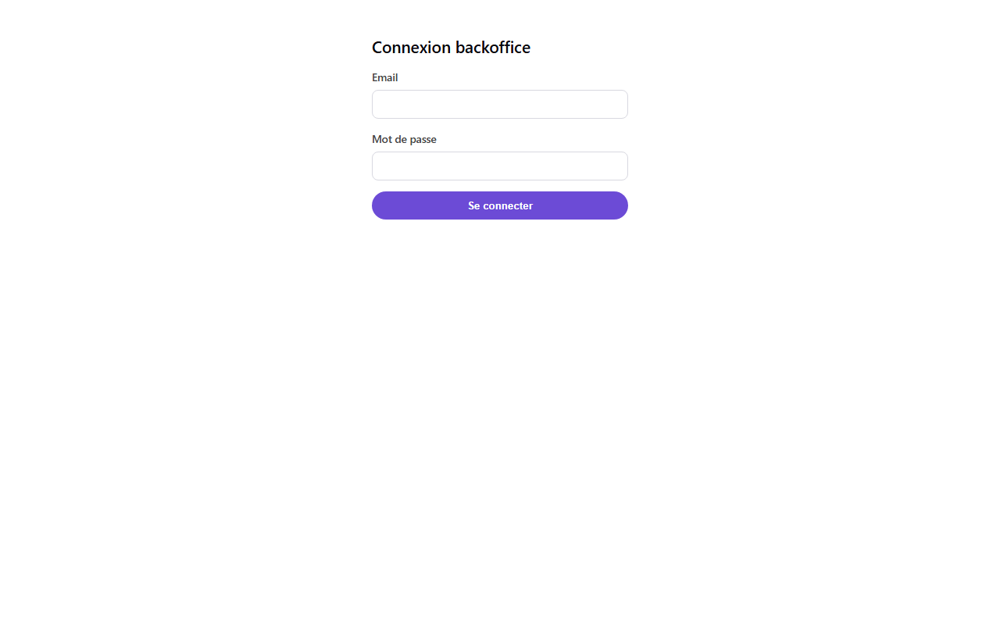
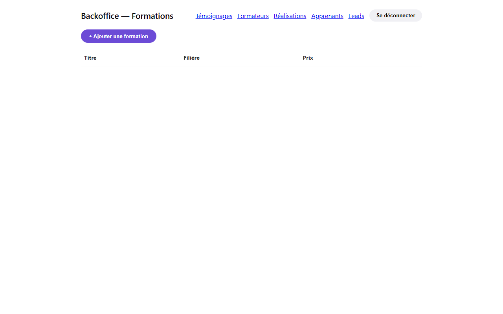
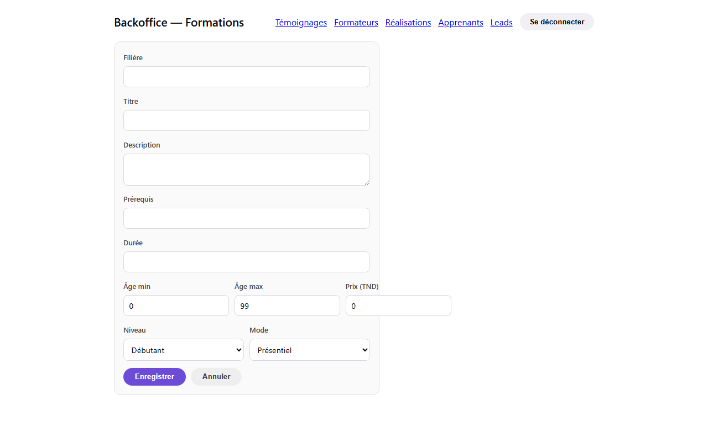
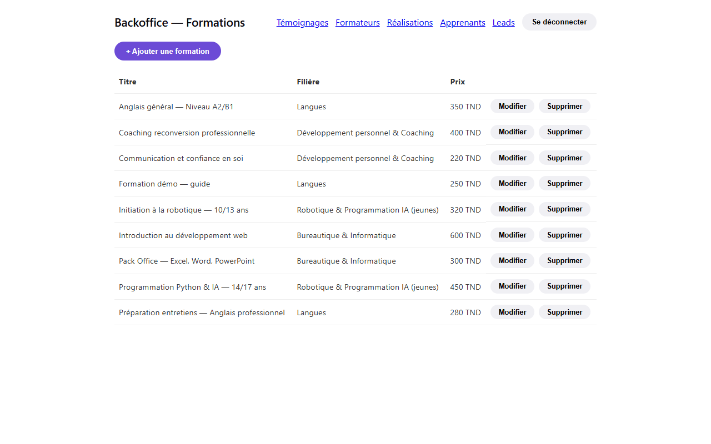
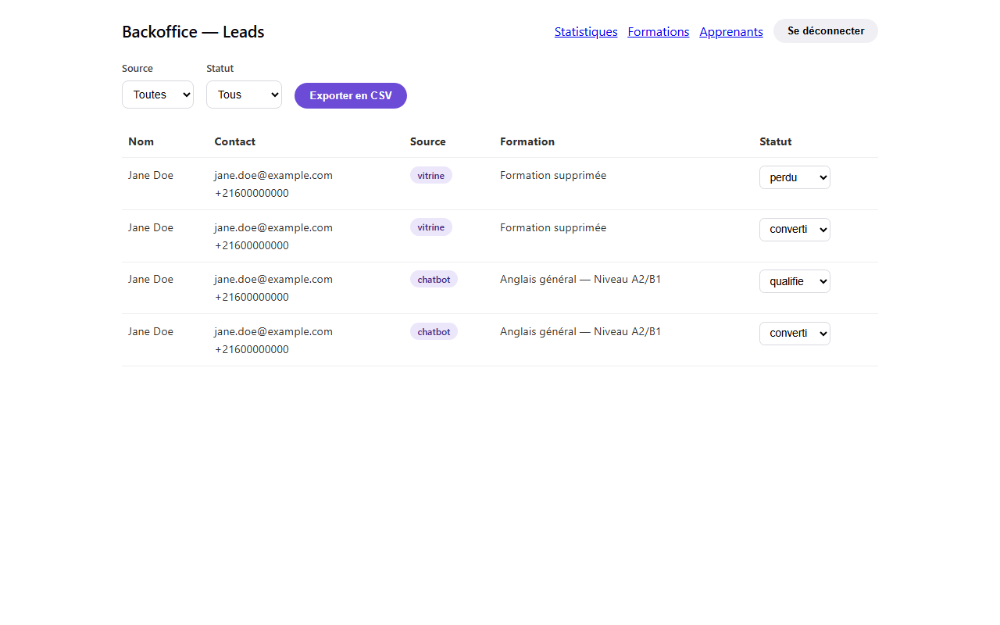
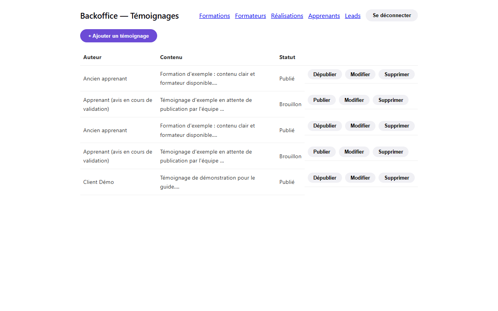
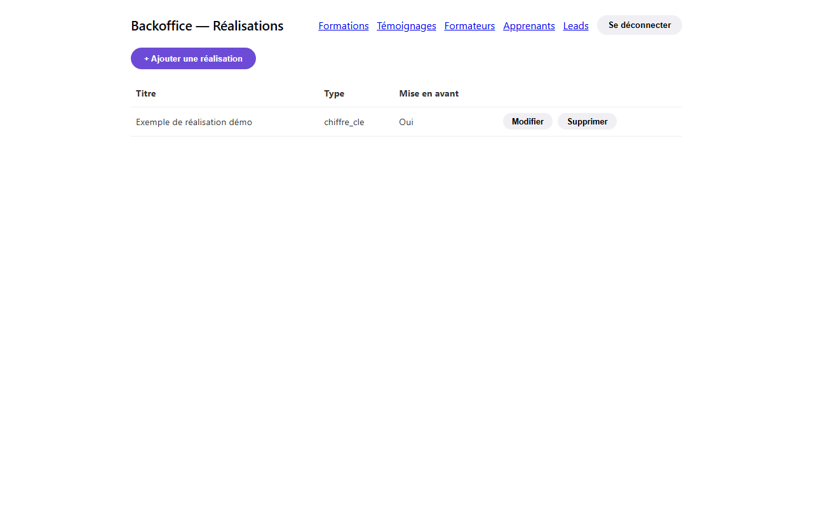

# Guide d'utilisation du backoffice HBA Connect

Ce guide s'adresse à l'équipe administrative de HBA Academy — aucune
connaissance technique n'est nécessaire. Il couvre les quatre gestes du
quotidien : publier une formation, suivre les demandes de contact
(« leads »), publier un témoignage, ajouter une réalisation.

> Ce guide doit être suivi d'une **session pratique en direct** avec
> l'équipe HBA sur l'environnement de staging, une fois celui-ci
> disponible (voir [DEPLOYMENT.md](./DEPLOYMENT.md)) — c'est cette
> session, pas seulement la lecture du guide, qui permet de valider que
> l'équipe est autonome (critère d'acceptation du ticket HBA-027).

## 1. Se connecter

Ouvrez l'adresse du backoffice fournie par l'équipe technique et ajoutez
`/admin/login` à la fin. Saisissez votre email et votre mot de passe, puis
cliquez sur **Se connecter**.

> Vous arrivez sur la liste des formations, qui sert de page d'accueil du
> backoffice. Un menu en haut de chaque page permet de naviguer entre
> Formations, Témoignages, Formateurs, Réalisations, Apprenants et Leads.
> Le bouton **Se déconnecter** est toujours en haut à droite.

## 2. Publier une formation

1. Depuis la page **Backoffice — Formations**, cliquez sur
   **+ Ajouter une formation**.

   

2. Remplissez le formulaire :

   

   - **Filière** : le domaine de la formation (ex. Langues, Bureautique & Informatique…)
   - **Titre**, **Description**, **Prérequis**, **Durée** : texte libre
   - **Âge min / Âge max** : tranche d'âge visée
   - **Prix (TND)**
   - **Niveau** : Débutant / Intermédiaire / Avancé
   - **Mode** : Présentiel / En ligne

3. Cliquez sur **Enregistrer**. La formation apparaît immédiatement dans
   la liste, et sur le site public dans la minute qui suit.

   

Pour modifier ou supprimer une formation existante, utilisez les boutons
**Modifier** / **Supprimer** sur sa ligne dans le tableau.

## 3. Suivre les demandes de contact (leads)

La page **Backoffice — Leads** (menu du haut) liste toutes les personnes
ayant laissé leurs coordonnées, que ce soit via le formulaire du site ou
via le chatbot.

- Les filtres **Source** (Vitrine / Chatbot) et **Statut** en haut
  permettent de retrouver rapidement un groupe de leads.
- Pour chaque lead, changez son **statut** (nouveau, qualifié, converti,
  perdu) directement dans le tableau au fur et à mesure de votre suivi
  commercial — c'est ce qui permet ensuite de mesurer le taux de
  conversion dans les statistiques.
- Le bouton **Exporter en CSV** télécharge la liste filtrée pour la
  retravailler dans Excel si besoin.

## 4. Publier un témoignage

1. Sur la page **Backoffice — Témoignages**, cliquez sur
   **+ Ajouter un témoignage**.
2. Choisissez la **Formation** concernée, renseignez l'**Auteur** et le
   **Contenu** du témoignage. Vous pouvez joindre une photo ou une courte
   vidéo avec **Ajouter une photo ou vidéo**.
3. Cochez **Publier immédiatement** si le témoignage doit apparaître
   tout de suite sur le site public — sinon il reste en **Brouillon** et
   vous pourrez le publier plus tard avec le bouton **Publier** sur sa
   ligne.
4. Cliquez sur **Enregistrer**.

Un témoignage en brouillon n'est jamais visible par les visiteurs du
site — c'est le bon réflexe pour relire un témoignage avant diffusion.

## 5. Ajouter une réalisation

Les réalisations alimentent la page « Preuves sociales » du site (chiffres
clés, concours, partenariats, événements).

1. Sur la page **Backoffice — Réalisations**, cliquez sur
   **+ Ajouter une réalisation**.
2. Choisissez le **Type** (Chiffre clé, Concours, Partenariat, Événement),
   renseignez le **Titre**, la **Description** et la **Date**.
3. Pour un chiffre clé, renseignez la **Valeur numérique** (ex. nombre
   d'apprenants formés).
4. Cochez **Mettre en avant sur la page d'accueil** si cette réalisation
   doit apparaître dès la page d'accueil du site.
5. Cliquez sur **Enregistrer**.

## Bon à savoir

- Toute action (ajout, modification, suppression) est **immédiate** :
  il n'y a pas d'étape de publication séparée pour les formations et les
  réalisations. Seuls les témoignages ont un statut brouillon/publié.
- Une suppression demande toujours une confirmation avant d'être
  définitive.
- En cas d'erreur ou de doute, contactez l'équipe technique plutôt que
  d'essayer de « corriger en base » — le backoffice est le seul endroit
  où modifier les données du site.
